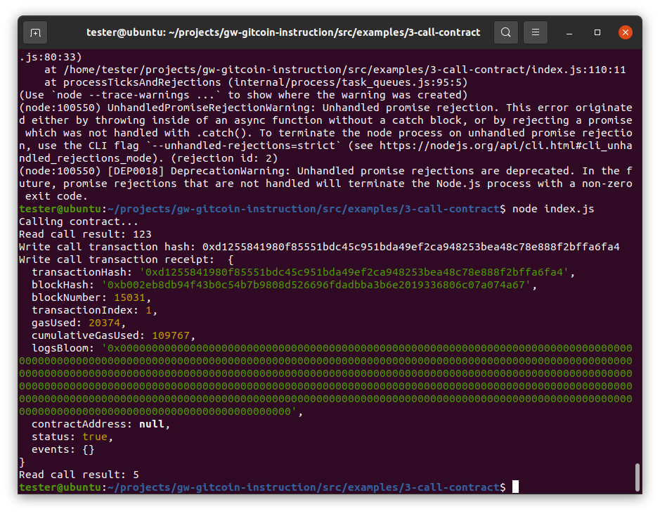

# Task Submission

1. A screenshot of the console output successfully issued a smart contract call. :
    


2. The transaction hash from the console output:
0xd1255841980f85551bdc45c951bda49ef2ca948253bea48c78e888f2bffa6fa4

3. The contract address:
0x331aD726F0F5d0A9311382015037E8c87Dd38b15

4. The ABI for contract you made a call on:
```
[
    {
      "inputs": [],
      "stateMutability": "payable",
      "type": "constructor"
    },
    {
      "inputs": [
        {
          "internalType": "uint256",
          "name": "x",
          "type": "uint256"
        }
      ],
      "name": "set",
      "outputs": [],
      "stateMutability": "payable",
      "type": "function"
    },
    {
      "inputs": [],
      "name": "get",
      "outputs": [
        {
          "internalType": "uint256",
          "name": "",
          "type": "uint256"
        }
      ],
      "stateMutability": "view",
      "type": "function"
    }
]
```