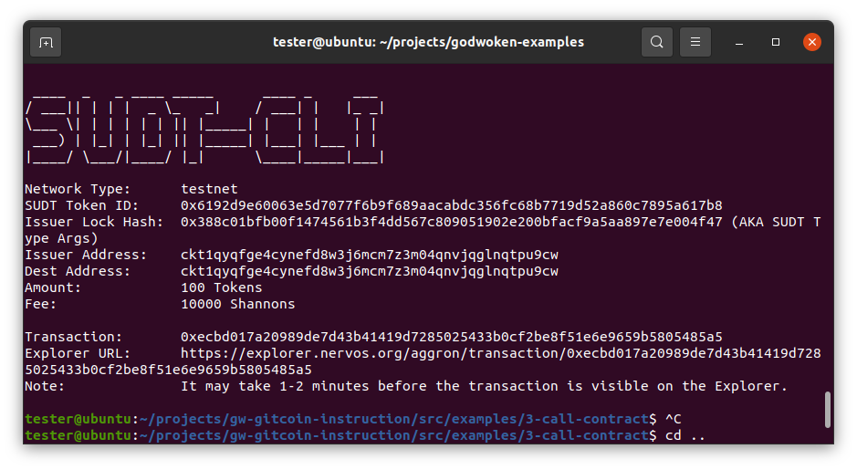
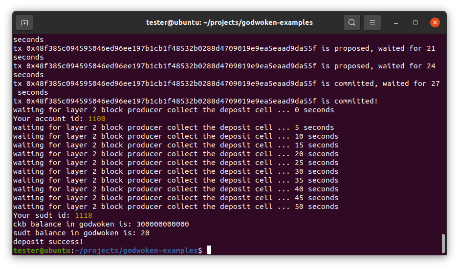

# Task Submission

1. A link to the Layer 1 address you funded on the [Testnet Explorer](https://explorer.nervos.org/aggron/address/ckt1qyqfge4cynefd8w3j6mcm7z3m04qnvjqglnqtpu9cw)
 
2. A screenshot of the console output immediately after using sudt-cli to create your SUDT tokens on Layer 1.

3. A link to the transaction ID created by sudt-cli on the [Testnet Explorer](https://explorer.nervos.org/aggron/transaction/0xecbd017a20989de7d43b41419d7285025433b0cf2be8f51e6e9659b5805485a5)

4. A screenshot of the console output immediately after you have successfully submitted a deposit to Layer 2 using the account-cli tool.

5. The SUDT ID from the console output after executing the deposit script (in text format).

1118

