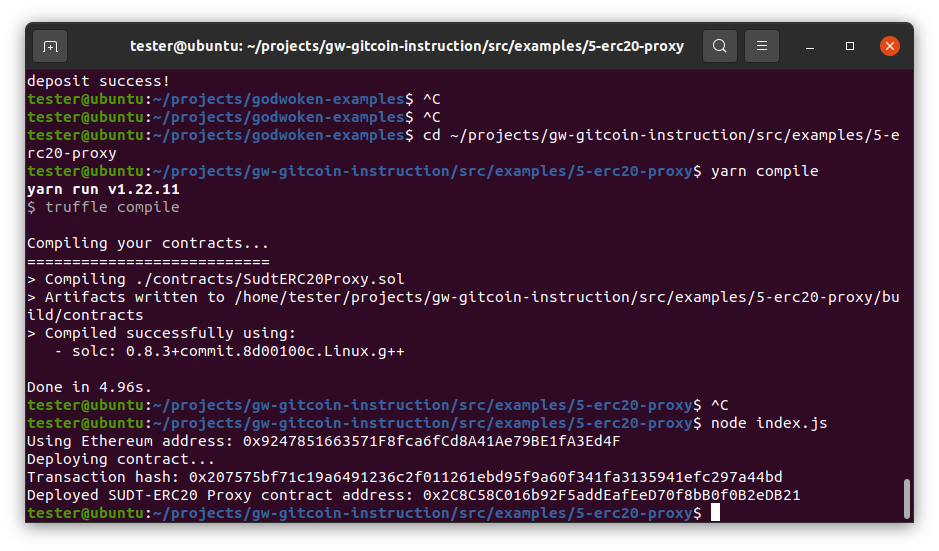
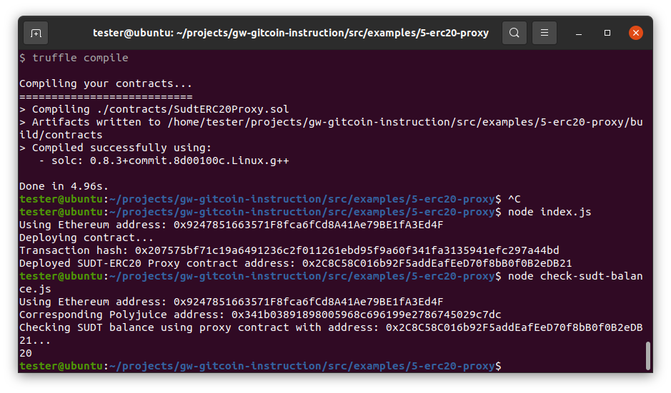

# Task Submission

1. A screenshot of the console output immediately after deploying smart contract

2. The address of the ERC20 Proxy Contract you deployed (in text format).
0x2C8C58C016b92F5addEafEeD70f8bB0f0B2eDB21

3. A screenshot of the console output immediately after checking your SUDT balance.

4. The Ethereum address that was checked (in text format).
0x9247851663571F8fca6fCd8A41Ae79BE1fA3Ed4F

