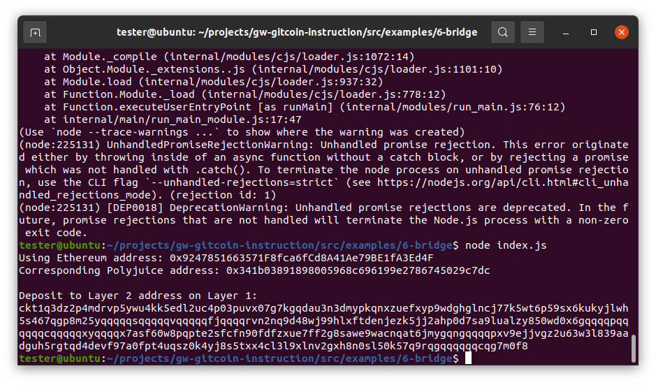

# Task Submission

1. A screenshot of the console output immediately after you have successfully generated your Deposit Receiver Address.

2. Your Deposit Receiver Address (in text format).
ckt1q3dz2p4mdrvp5ywu4kk5edl2uc4p03puvx07g7kgqdau3n3dmypkqnxzuefxyp9wdghglncj77k5wt6p59sx6kukyjlwh5s467qgp8m25yqqqqqsqqqqqvqqqqqfjqqqqrvn2nq9d48wj99hlxftdenjezk5jj2ahp0d7sa9lualzy850wd0x6gqqqqpqqqqqqcqqqqqxyqqqqx7asf60w8pqpte2sfcfn90fdfzxue7ff2g8sawe9wacnqat6jmygqngqqqqpxv9ejjvgz2u63w3l839aadguh5rgtqd4devf97a0fpt4uqsz0k4yj8s5txx4cl3l9xlnv2gxh8n0sl50k57q9rqgqqqqqqcqg7m0f8

3. The Ethereum address used to generate the Deposit Receiver Address (in text format).
0x9247851663571F8fca6fCd8A41Ae79BE1fA3Ed4F

4. A [link](https://rinkeby.etherscan.io/tx/0xcfecd60e5a26ba73febef851cbd4180f1ac0763553531b4af850e1b46ed725ab) to the Etherscan explorer for the successful Force Bridge transaction. This can be found on Force Bridge under History→Succeed.

5. A [link](https://explorer.nervos.org/aggron/transaction/0x6520b94014cde89f3c314d52f1e2c0e2acf98ee3f4871327c7aede682761fd91) to the Nervos explorer for the successful Force bridge transaction. This can be found on Force Bridge under History→Succeed.
